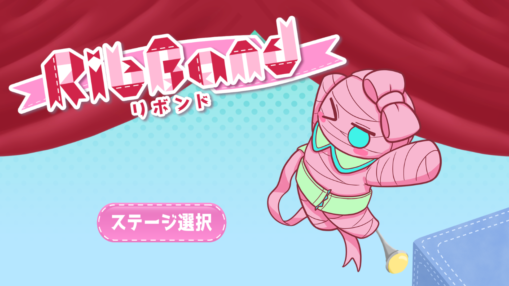
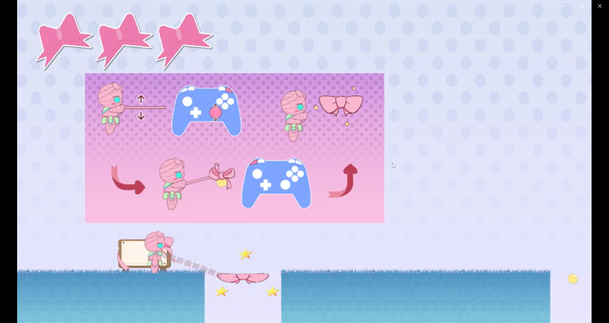
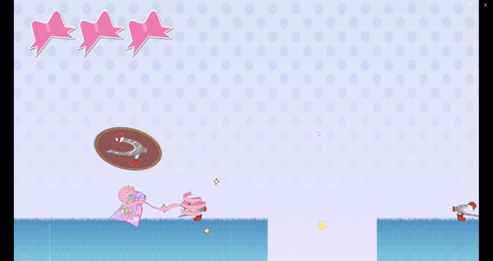
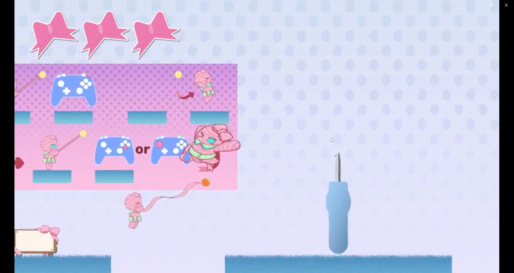

# RibBond

## 概要
コントローラーのスティックを回転させてリボンを巻き取り、
敵やオブジェクトを「飾る」ことでクリアしていく横スクロールアクションゲーム。
「飾る喜びが、より高いクリアの快感を生み出す」というコンセプトのもと、
チーム（プログラマー5名）で制作。

## スクリーンショット

## 使用技術
C++ / DirectX11

## 開発体制
本プロジェクトは学内のチーム制作（プログラマー5名）による作品です。
